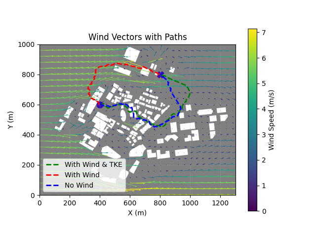
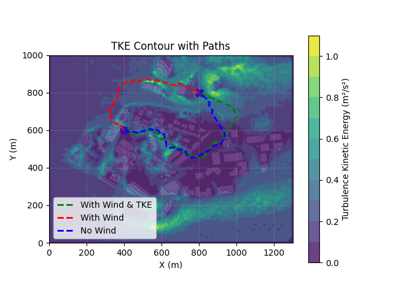
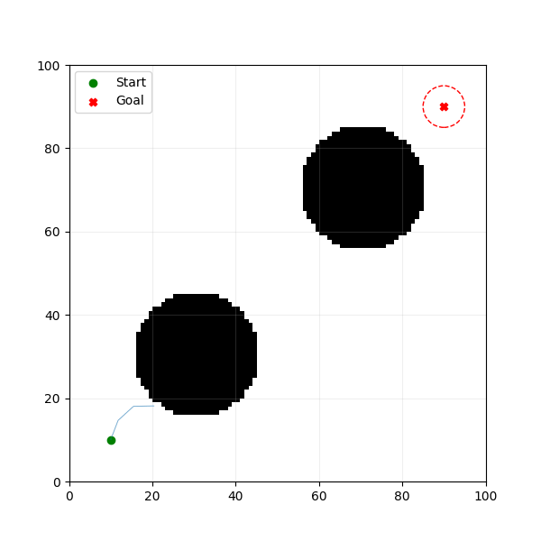

# Wind-Aware RRT\* Planner for UAV

This repository presents a Wind-Aware RRT\* (Rapidly-exploring Random Tree Star) path planning algorithm tailored for Unmanned Aerial Vehicles (UAVs) operating in urban environments. Developed as part of a Final Year Project (FYP), the planner integrates wind velocity and turbulence kinetic energy (TKE) data to enhance UAV flight safety and efficiency.

## Project Overview

Urban landscapes introduce complex aerodynamic challenges due to structures like buildings and narrow passages. This project enhances the traditional RRT\* algorithm by:

* Incorporating wind velocity vectors into the planning process.
* Evaluating wind-induced risks using Turbulent Kinetic Energy (TKE).
* Planning feasible, efficient, and safe paths in wind-aware and turbulence-aware conditions.

## Repository Structure

```
Wind-Aware-RRT--Planner-for-UAV/
├── code snippets/             # Contains core algorithm implementations
├── input_data/                # CFD velocity and TKE input files
├── output_data/               # Sample outputs and visualizations
├── .gitattributes
├── .gitignore
├── README.md                  # Project documentation
├── multiple_runs.py           # Script for batch simulations
├── requirements.txt           # Python dependencies
├── rrtstar_rewire_highlight.gif # Visualization of RRT* rewire process
├── single_run.py              # Script for a single simulation run
├── statistical_analysis.py    # Statistical analysis of simulation results
├── tke_contour.png            # TKE contour visualization
├── visuals.ipynb              # Jupyter notebook for RRT* visualization
├── wind_vectors.png           # Wind vector field visualization
```

## Features

* **Wind-Aware Planning**: Integrates wind velocity data into the RRT\* algorithm to account for environmental factors.
* **TKE-Based Risk Assessment**: Utilizes Turbulence Kinetic Energy data to evaluate and mitigate potential risks in the planned path.
* **Batch Simulation Capability**: `multiple_runs.py` allows for conducting multiple simulations to assess planner performance under varying conditions and recording obtained data to .xslx file.
* **Comprehensive Visualization**: `visuals.ipynb` provides tools for visualizing RRT* logics.
* **Statistical Analysis**: `statistical_analysis.py` offers insights into the performance metrics of the planner across different scenarios.

## Requirements

* Python 3.8 or higher
* Required Python packages listed in `requirements.txt`

Install dependencies using:

```bash
pip install -r requirements.txt
```

## Usage

### Single Simulation Run

To execute a single simulation:

```bash
python single_run.py
```

### Multiple Simulation Runs

For batch simulations:

```bash
python multiple_runs.py
```

Ensure that `input_data/` contains the necessary wind and TKE data files before running simulations.

## Sample Results

* **Wind Vector Field**:
  

* **TKE Contour**:
  

* **RRT* Rewire Process*\*:
  

## Author

**Elnur Esenalieva**
* Final Year Project
* Department of Mechanical Engineering, City University of Hong Kong
* Supervisor: Dr Penghao DUAN
* Year: 2025

## License

[MIT License](LICENSE) — Feel free to use and modify with proper attribution.

