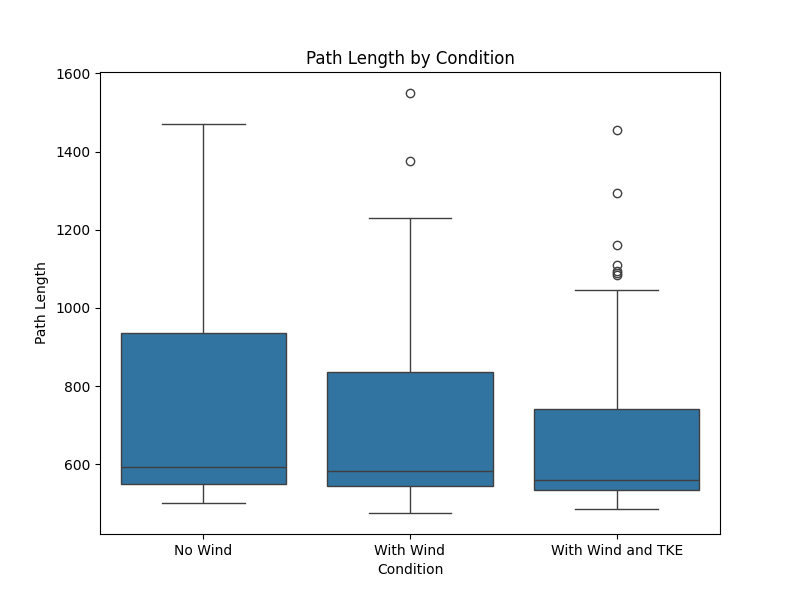
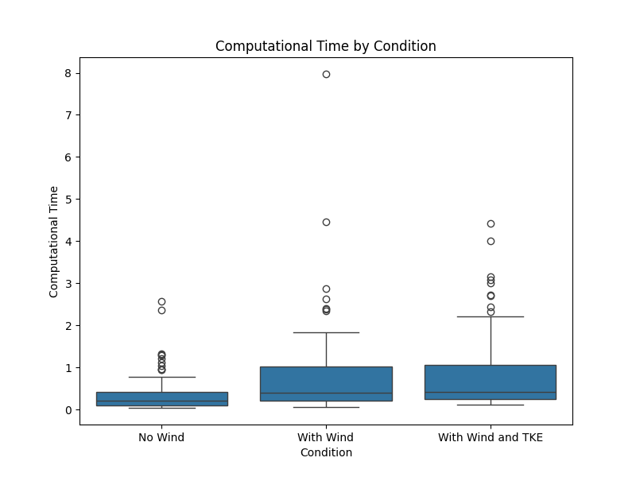
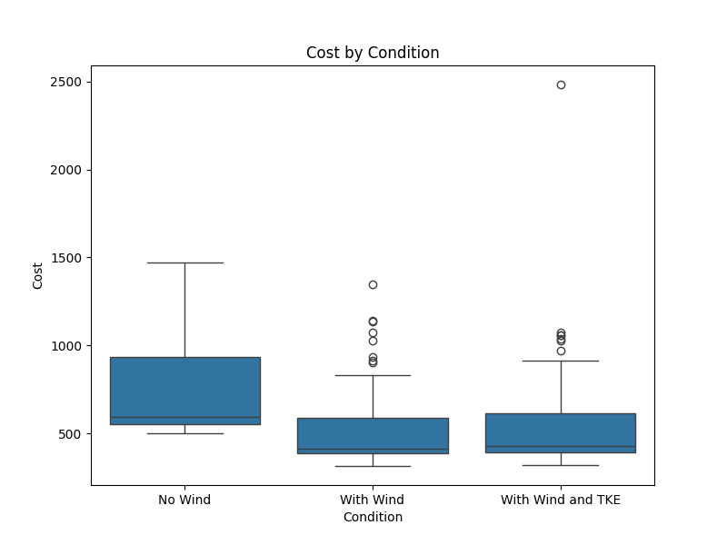

# Statistical Analysis Report

## Descriptive Statistics

| Condition         |   ('Run_ID', 'count') |   ('Run_ID', 'mean') |   ('Run_ID', 'std') |   ('Run_ID', 'min') |   ('Run_ID', '25%') |   ('Run_ID', '50%') |   ('Run_ID', '75%') |   ('Run_ID', 'max') |   ('Start_X', 'count') |   ('Start_X', 'mean') |   ('Start_X', 'std') |   ('Start_X', 'min') |   ('Start_X', '25%') |   ('Start_X', '50%') |   ('Start_X', '75%') |   ('Start_X', 'max') |   ('Start_Y', 'count') |   ('Start_Y', 'mean') |   ('Start_Y', 'std') |   ('Start_Y', 'min') |   ('Start_Y', '25%') |   ('Start_Y', '50%') |   ('Start_Y', '75%') |   ('Start_Y', 'max') |   ('Goal_X', 'count') |   ('Goal_X', 'mean') |   ('Goal_X', 'std') |   ('Goal_X', 'min') |   ('Goal_X', '25%') |   ('Goal_X', '50%') |   ('Goal_X', '75%') |   ('Goal_X', 'max') |   ('Goal_Y', 'count') |   ('Goal_Y', 'mean') |   ('Goal_Y', 'std') |   ('Goal_Y', 'min') |   ('Goal_Y', '25%') |   ('Goal_Y', '50%') |   ('Goal_Y', '75%') |   ('Goal_Y', 'max') |   ('Path Length', 'count') |   ('Path Length', 'mean') |   ('Path Length', 'std') |   ('Path Length', 'min') |   ('Path Length', '25%') |   ('Path Length', '50%') |   ('Path Length', '75%') |   ('Path Length', 'max') |   ('Cost', 'count') |   ('Cost', 'mean') |   ('Cost', 'std') |   ('Cost', 'min') |   ('Cost', '25%') |   ('Cost', '50%') |   ('Cost', '75%') |   ('Cost', 'max') |   ('Computational Time', 'count') |   ('Computational Time', 'mean') |   ('Computational Time', 'std') |   ('Computational Time', 'min') |   ('Computational Time', '25%') |   ('Computational Time', '50%') |   ('Computational Time', '75%') |   ('Computational Time', 'max') |
|:------------------|----------------------:|---------------------:|--------------------:|--------------------:|--------------------:|--------------------:|--------------------:|--------------------:|-----------------------:|----------------------:|---------------------:|---------------------:|---------------------:|---------------------:|---------------------:|---------------------:|-----------------------:|----------------------:|---------------------:|---------------------:|---------------------:|---------------------:|---------------------:|---------------------:|----------------------:|---------------------:|--------------------:|--------------------:|--------------------:|--------------------:|--------------------:|--------------------:|----------------------:|---------------------:|--------------------:|--------------------:|--------------------:|--------------------:|--------------------:|--------------------:|---------------------------:|--------------------------:|-------------------------:|-------------------------:|-------------------------:|-------------------------:|-------------------------:|-------------------------:|--------------------:|-------------------:|------------------:|------------------:|------------------:|------------------:|------------------:|------------------:|----------------------------------:|---------------------------------:|--------------------------------:|--------------------------------:|--------------------------------:|--------------------------------:|--------------------------------:|--------------------------------:|
| No Wind           |                   100 |                 50.5 |             29.0115 |                   1 |               25.75 |                50.5 |               75.25 |                 100 |                     99 |                   400 |                    0 |                  400 |                  400 |                  400 |                  400 |                  400 |                     99 |                   600 |                    0 |                  600 |                  600 |                  600 |                  600 |                  600 |                    99 |                  800 |                   0 |                 800 |                 800 |                 800 |                 800 |                 800 |                    99 |                  800 |                   0 |                 800 |                 800 |                 800 |                 800 |                 800 |                        100 |                   737.061 |                  238.908 |                      500 |                      550 |                    592.5 |                  935     |                     1470 |                 100 |            737.061 |           238.908 |           500     |           550     |           592.5   |           935     |           1470    |                               100 |                         0.36123  |                        0.438463 |                       0.038166  |                       0.0966851 |                        0.20161  |                        0.419813 |                         2.57407 |
| With Wind         |                   100 |                 50.5 |             29.0115 |                   1 |               25.75 |                50.5 |               75.25 |                 100 |                     99 |                   400 |                    0 |                  400 |                  400 |                  400 |                  400 |                  400 |                     99 |                   600 |                    0 |                  600 |                  600 |                  600 |                  600 |                  600 |                    99 |                  800 |                   0 |                 800 |                 800 |                 800 |                 800 |                 800 |                    99 |                  800 |                   0 |                 800 |                 800 |                 800 |                 800 |                 800 |                        100 |                   700.237 |                  222.887 |                      475 |                      545 |                    582.5 |                  835     |                     1550 |                 100 |            519.594 |           213.579 |           315.183 |           385.43  |           414.332 |           590.996 |           1349.21 |                               100 |                         0.782553 |                        1.03271  |                       0.0496173 |                       0.202762  |                        0.404661 |                        1.01798  |                         7.97183 |
| With Wind and TKE |                   100 |                 50.5 |             29.0115 |                   1 |               25.75 |                50.5 |               75.25 |                 100 |                     99 |                   400 |                    0 |                  400 |                  400 |                  400 |                  400 |                  400 |                     99 |                   600 |                    0 |                  600 |                  600 |                  600 |                  600 |                  600 |                    99 |                  800 |                   0 |                 800 |                 800 |                 800 |                 800 |                 800 |                    99 |                  800 |                   0 |                 800 |                 800 |                 800 |                 800 |                 800 |                        100 |                   663.804 |                  205.841 |                      485 |                      535 |                    560   |                  740.218 |                     1455 |                 100 |            545.26  |           283.748 |           321.848 |           393.647 |           428.9   |           616.415 |           2482.62 |                               100 |                         0.834406 |                        0.908617 |                       0.104604  |                       0.244831  |                        0.422396 |                        1.05427  |                         4.4294  |

## Assumption Checks

### Path Length

- Shapiro-Wilk test for No Wind: stat = 0.836, p = 0.000

- Shapiro-Wilk test for With Wind: stat = 0.811, p = 0.000

- Shapiro-Wilk test for With Wind and TKE: stat = 0.732, p = 0.000

### Computational Time

- Shapiro-Wilk test for No Wind: stat = 0.683, p = 0.000

- Shapiro-Wilk test for With Wind: stat = 0.613, p = 0.000

- Shapiro-Wilk test for With Wind and TKE: stat = 0.743, p = 0.000

### Cost

- Shapiro-Wilk test for No Wind: stat = 0.836, p = 0.000

- Shapiro-Wilk test for With Wind: stat = 0.787, p = 0.000

- Shapiro-Wilk test for With Wind and TKE: stat = 0.619, p = 0.000

- Levene's test for Path Length: stat = 2.395, p = 0.093

- Levene's test for Computational Time: stat = 5.922, p = 0.003

- Levene's test for Cost: stat = 1.157, p = 0.316

## Consistency Tests (Without Wind vs. With Wind and TKE)

### Path Length

- Mann-Whitney U test: U = 6047.000, p = 0.011, r = 1.045

- Significant (Bonferroni alpha = 0.0167)

### Computational Time

- Mann-Whitney U test: U = 2682.000, p = 0.000, r = 0.463

- Significant (Bonferroni alpha = 0.0167)

### Cost

- Mann-Whitney U test: U = 8075.000, p = 0.000, r = 1.395

- Significant (Bonferroni alpha = 0.0167)

## Efficiency Tests (All Conditions)

### Path Length

- Kruskal-Wallis test: H = 6.688, p = 0.035, epsilon^2 = 0.000

- Not significant (Bonferroni alpha = 0.0167)

### Computational Time

- Kruskal-Wallis test: H = 36.323, p = 0.000, epsilon^2 = 0.000

- Significant (Bonferroni alpha = 0.0167)

- Dunn's Post-Hoc:

|                   |     No Wind |   With Wind |   With Wind and TKE |
|:------------------|------------:|------------:|--------------------:|
| No Wind           | 1           | 3.07334e-06 |         1.73353e-08 |
| With Wind         | 3.07334e-06 | 1           |         0.331633    |
| With Wind and TKE | 1.73353e-08 | 0.331633    |         1           |

### Cost

- Kruskal-Wallis test: H = 73.318, p = 0.000, epsilon^2 = 0.001

- Significant (Bonferroni alpha = 0.0167)

- Dunn's Post-Hoc:

|                   |     No Wind |   With Wind |   With Wind and TKE |
|:------------------|------------:|------------:|--------------------:|
| No Wind           | 1           | 1.24426e-14 |         1.45351e-12 |
| With Wind         | 1.24426e-14 | 1           |         0.527018    |
| With Wind and TKE | 1.45351e-12 | 0.527018    |         1           |
